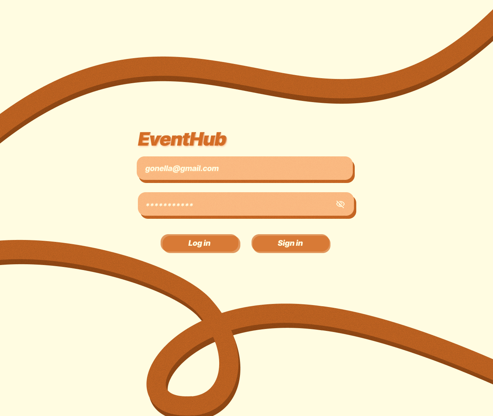
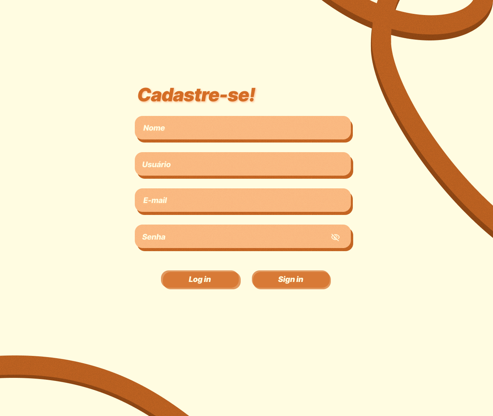
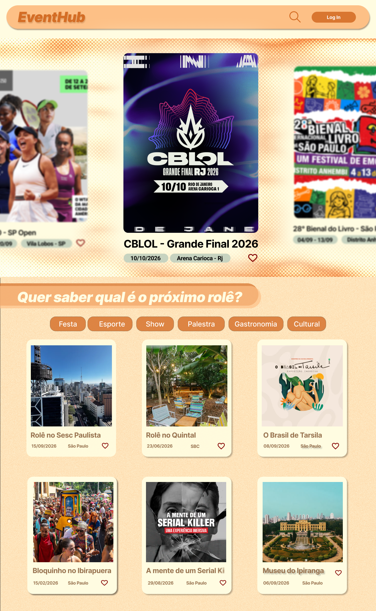
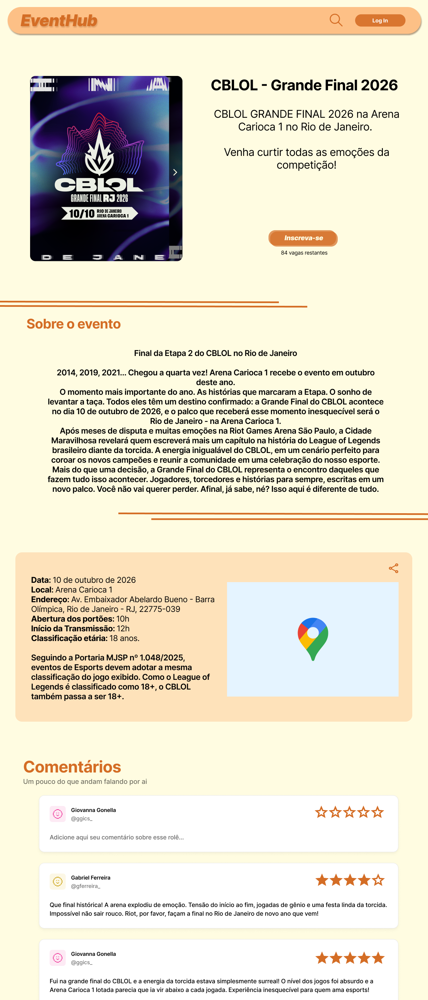
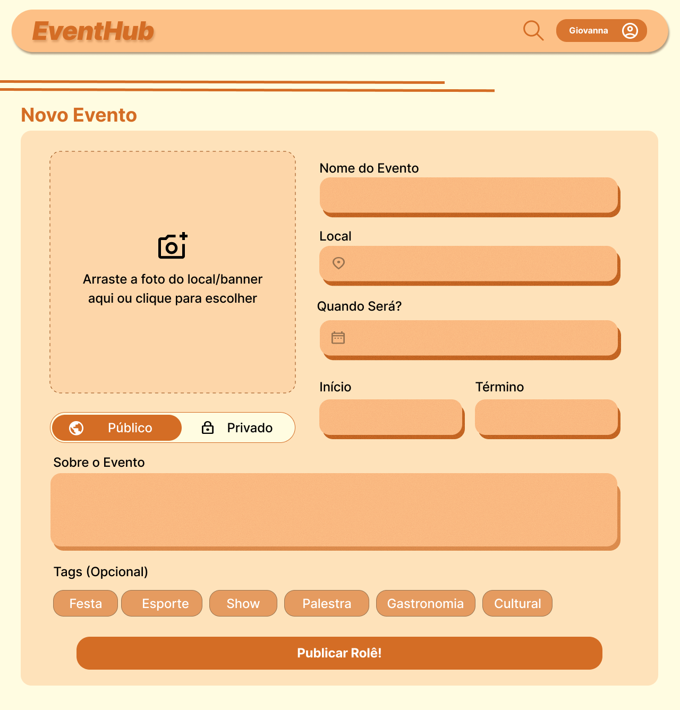
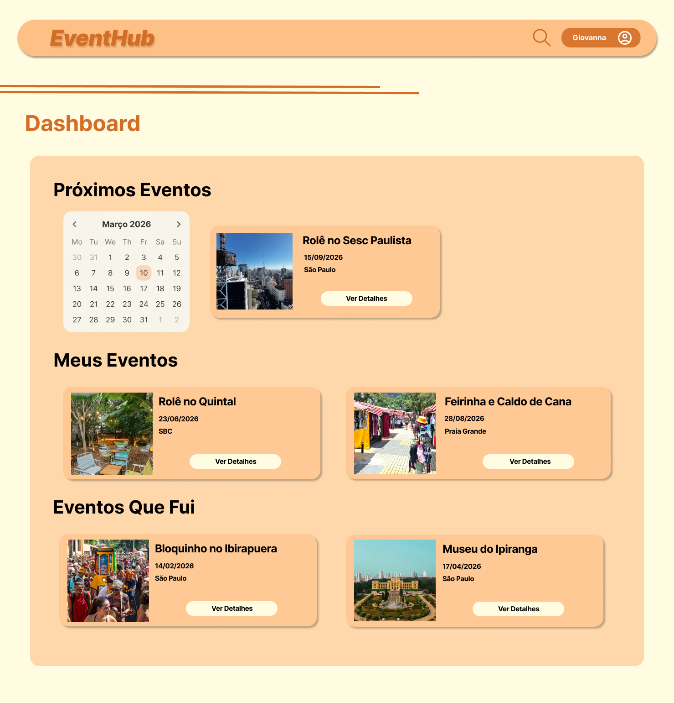
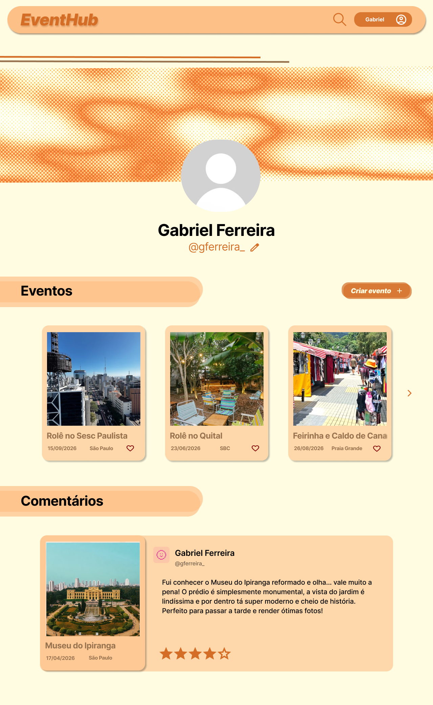
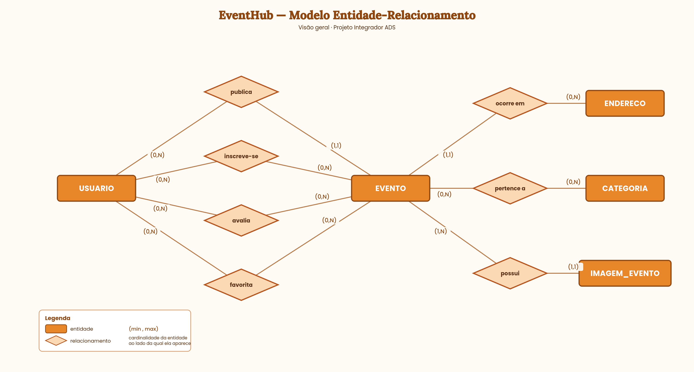

# EventHub

## Descrição

O projeto consiste no desenvolvimento de uma plataforma web para divulgação de eventos e registro de participação. Qualquer usuário cadastrado pode publicar eventos e se inscrever em eventos publicados por outros usuários.

Cada usuário possui um painel pessoal que organiza sua trajetória em três situações: eventos futuros em que está inscrito, eventos já realizados dos quais participou, e eventos que ele mesmo publicou.

Após a realização de um evento, os usuários que estavam inscritos podem registrar uma avaliação e um comentário sobre a experiência, formando um histórico pessoal e público de participação.

## Funcionalidades

### Conta
- Criar conta
- Entrar e sair
- Editar perfil
- Ver perfil de outro usuário

### Eventos
- Criar evento
- Editar evento
- Cancelar evento
- Ver meus eventos criados
- Definir evento como público ou privado
- Adicionar múltiplas imagens ao evento

### Buscar
- Ver lista de eventos
- Buscar por nome
- Filtrar por categoria, cidade e data
- Ver página do evento
- Favoritar evento

### Inscrição
- Se inscrever num evento
- Cancelar inscrição
- Mostrar vagas restantes e evento esgotado

### Avaliação
- Comentar e dar nota depois do evento
- Só quem foi pode avaliar
- Uma avaliação por pessoa
- Editar ou apagar seu comentário
- Ver as avaliações do evento

### Dashboard
- Eventos que vou
- Eventos que já fui
- Eventos que criei

## Protótipos

### Login

### Cadastro

### Home

### Detalhe do evento

### Novo evento

### Dashboard

### Perfil

## Modelo Entidade-Relacionamento

